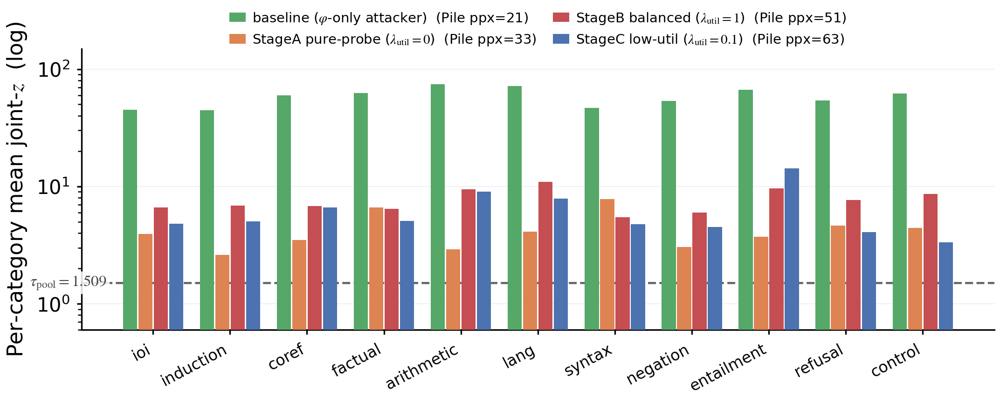
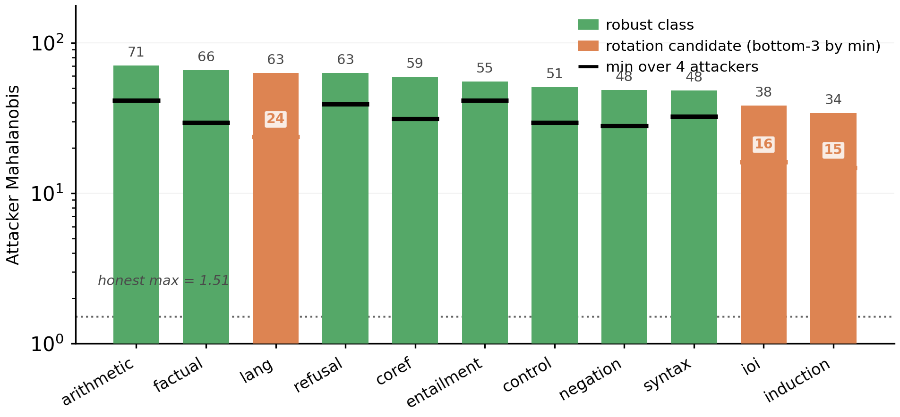
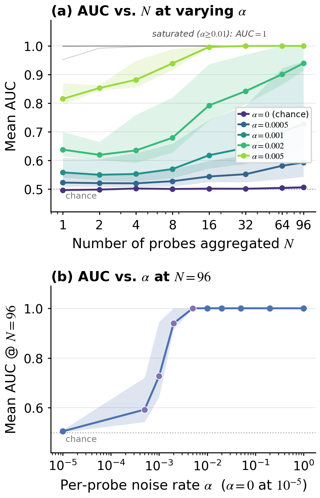
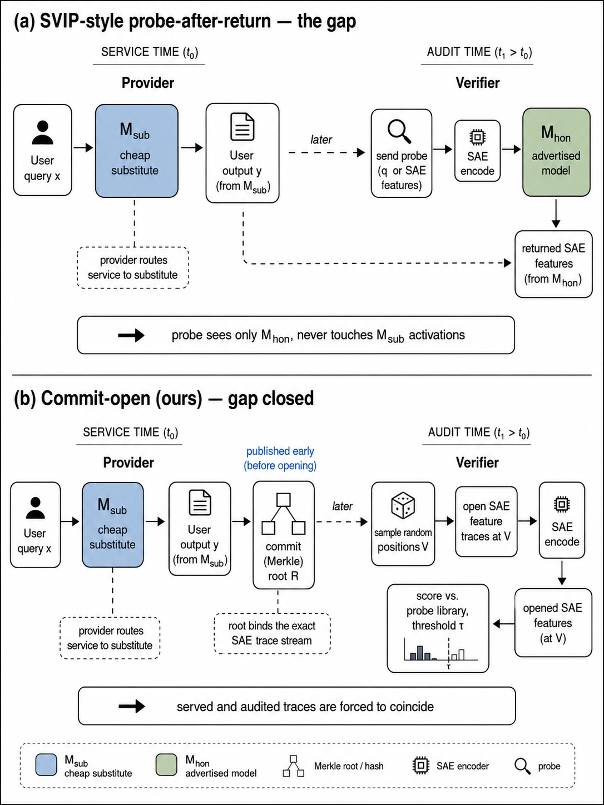
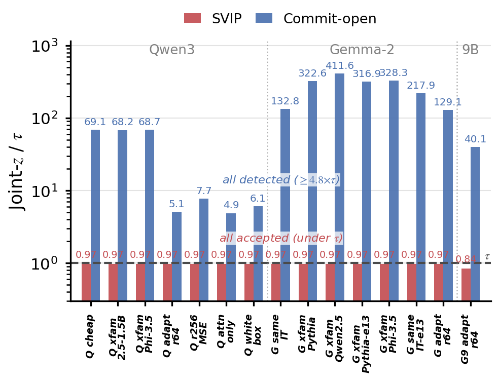
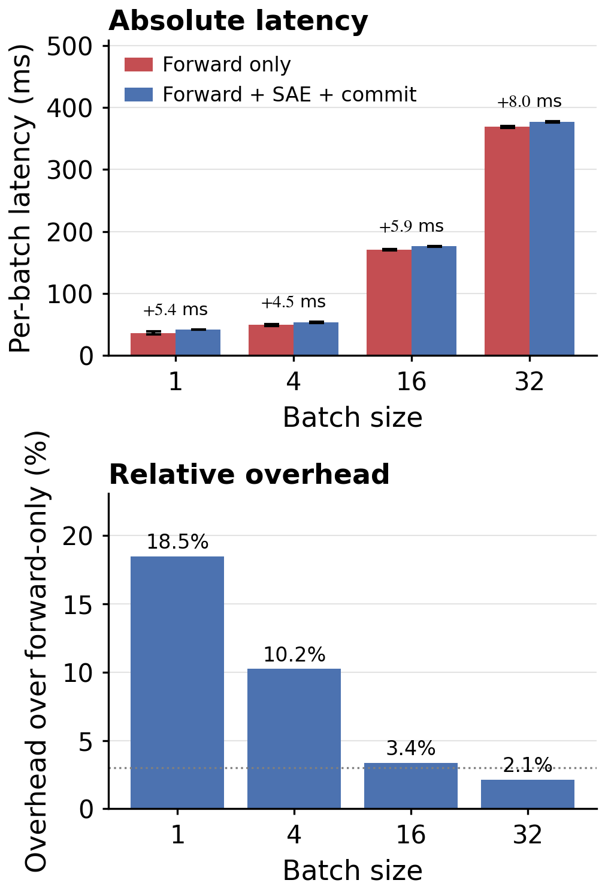

<div align="center">

# Which Circuits Define a Language Model?

**Capacity-Dependent Crossover in SAE Feature Traces**

Anonymous EMNLP 2026 artifact for the paper's SAE-circuit trace experiments,
capacity-dependent attackability analysis, and commit-open hosted-LLM
verification application.

This repository contains the code, configuration, result logs, and manuscript
figures needed to audit the paper's main empirical claims.

</div>

---

## Reviewer Guide

If you are reviewing the paper, start here:

| What to check | Where |
| --- | --- |
| Claim-to-artifact mapping | [`ARTIFACTS.md`](ARTIFACTS.md) |
| Headline numbers and thresholds | [`RESULTS.md`](RESULTS.md) |
| CPU-only table regeneration | `scripts/09_e3_score.py`, `scripts/14_calibration_bootstrap.py`, `scripts/15_e11_svip_analysis.py`, `scripts/18_ksweep_posthoc.py`, `scripts/22_covariate_analysis.py` |
| GPU reruns | `modal/*.py` |
| Raw committed measurements | `results/*.json` |
| Manuscript figures for orientation | [`paper_figures/`](paper_figures/) |

The artifact is intentionally anonymous. Large model weights, SAE checkpoints,
Hugging Face caches, and Modal volumes are not checked in; GPU reruns download
public model and SAE releases through the scripts.

---

## Paper Thesis

The paper asks which internal computations make a language model hard to
impersonate, and whether the answer changes with attacker capacity. It builds a
per-position sparse-autoencoder (SAE) circuit trace over a 96-probe
named-circuit library spanning 11 categories.

The core empirical result is a capacity-dependent inversion: low-rank
probe-aware LoRA attackers first erode attention-pattern circuits such as
induction, IOI, and coreference, while high-rank attackers shift pressure
toward surface circuits such as factual recall, syntax, and language. The full
96-probe joint score remains above the honest threshold across tested
substitutes and attacker regimes. The hosted-LLM verification protocol is the
paper's application: the same trace is bound with a Merkle commit-open step to
close the parallel-serve side channel.

<p align="center">
  
  
</p>

---

## Results at a Glance

All numeric claims below are tied to committed JSON logs or manuscript figures.
See [`ARTIFACTS.md`](ARTIFACTS.md) for the exact script and log mapping.

| Claim | Evidence |
| --- | --- |
| Per-class attackability has a capacity-dependent crossover: attention-pattern circuits collapse first at low rank, while surface circuits become more attackable at high rank. | `results/per_class_rank_matrix.json`, `results/e14_gemma_adaptive_lora.json`, `paper_figures/adaptive_lora_profile.png`, `paper_figures/per_class_attackability.png` |
| Same-family, cross-family, adaptive, white-box, attention-only, and ablation attackers remain detectable under the joint SAE trace score. | `results/e3_v2_scored.json`, `results/e13_gemma_scored.json`, `results/e16_whitebox_jointz_qwen3.json`, `results/e24_attn_only_qwen3_r64_attn_only_mse.json`, `results/multiseed_rank_sweep.json` |
| Detection is robust to probe-count and top-k sweeps. | `results/e5_v2_joint_n_sweep.json`, `results/ksweep_results.json`, `paper_figures/joint_probe_sweep.png` |
| The SVIP-style probe-after-return baseline misses matched parallel-serve attackers, while commit-open detects them. | `results/e11_svip_vs_ours.json`, `results/recipe3_svip_two_backbone.json`, `paper_figures/svip_vs_commit_open.png` |
| Serving overhead is small at production batch sizes. | `results/e9_overhead.json`, `paper_figures/serving_overhead.png` |

<p align="center">
  
  
</p>

<p align="center">
  
  
</p>

---

## Reproducing Tables from Committed Logs

The quickest reviewer path is CPU-only and reads the checked-in JSON logs:

```bash
python -m venv .venv
source .venv/bin/activate
pip install -r requirements.txt

python scripts/09_e3_score.py
python scripts/14_calibration_bootstrap.py
python scripts/15_e11_svip_analysis.py
python scripts/18_ksweep_posthoc.py
python scripts/22_covariate_analysis.py
```

These commands do not require downloading model weights. They recompute summary
statistics and tables from files already committed under `results/`.

---

## GPU Reruns

GPU experiments are implemented as Modal entrypoints. They require access to the
public backbone and SAE releases used by the paper.

```bash
modal secret create huggingface-secret HF_TOKEN=...
modal run modal/e2_same_family.py
modal run modal/e3_cross_family.py
modal run modal/e12_gemma_pilot.py
```

Backbone, layer, SAE release, top-k, and kernel choices are centralized in
[`config.py`](config.py). The repository does not claim to host model weights or
datasets itself.

---

## Repository Layout

```text
.
├── README.md
├── ARTIFACTS.md                 paper claims -> scripts -> logs
├── RESULTS.md                   reviewer-facing numeric summary
├── config.py                    backbone / SAE / kernel configuration
├── scripts/                     CPU and post-hoc analysis scripts
├── modal/                       GPU experiment entrypoints
├── results/                     committed JSON and text result logs
└── paper_figures/               selected manuscript figures
```

Numbered scripts follow the order of the paper where possible. `eXX_*` scripts
cover appendix experiments, stress tests, and additional adversarial settings.

---

## Citation

```bibtex
@inproceedings{anonymous2026saetraces,
  title     = {Which Circuits Define a Language Model? Capacity-Dependent Crossover in SAE Feature Traces},
  author    = {Anonymous},
  booktitle = {Proceedings of EMNLP 2026},
  year      = {2026},
  note      = {Under double-blind review}
}
```

## License and Anonymity

The code is released under the [MIT License](LICENSE) for double-blind review.
Author identities, institution affiliations, private infrastructure details,
large model weights, local caches, Modal volumes, and virtual environments are
excluded intentionally.
